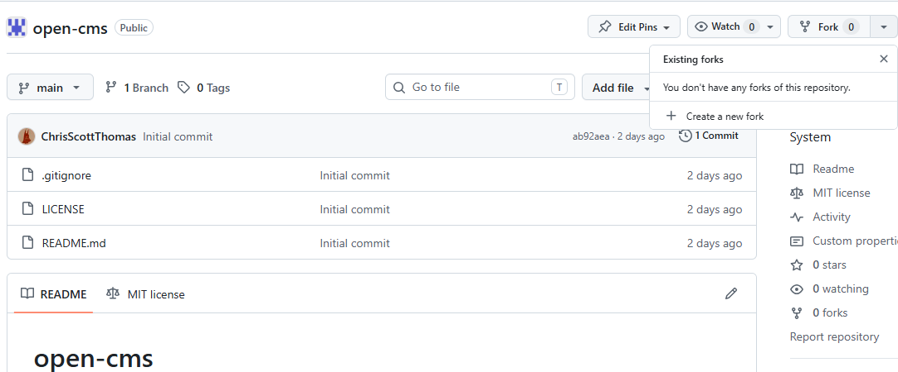
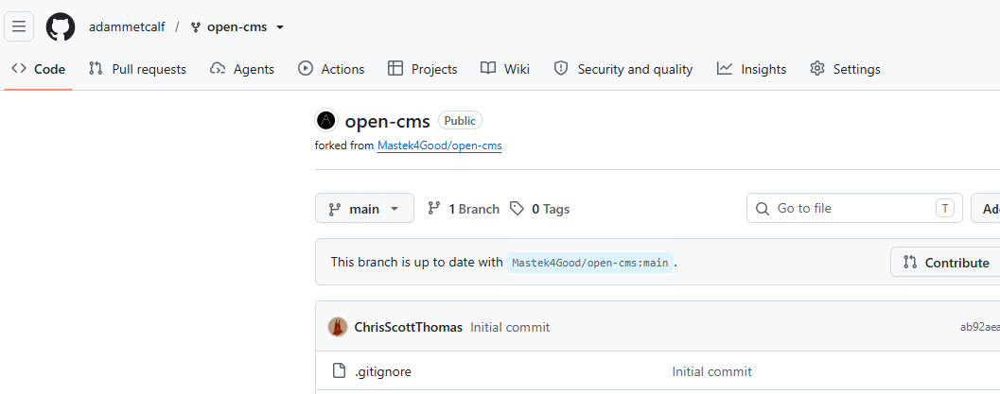
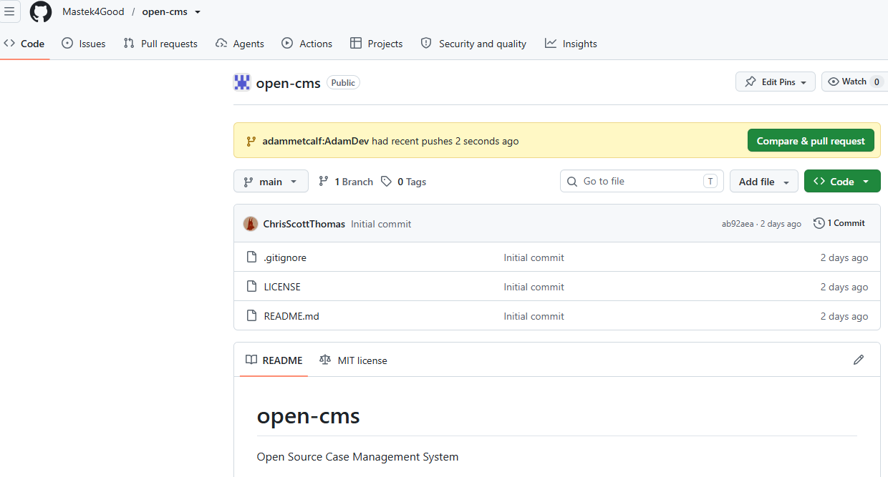
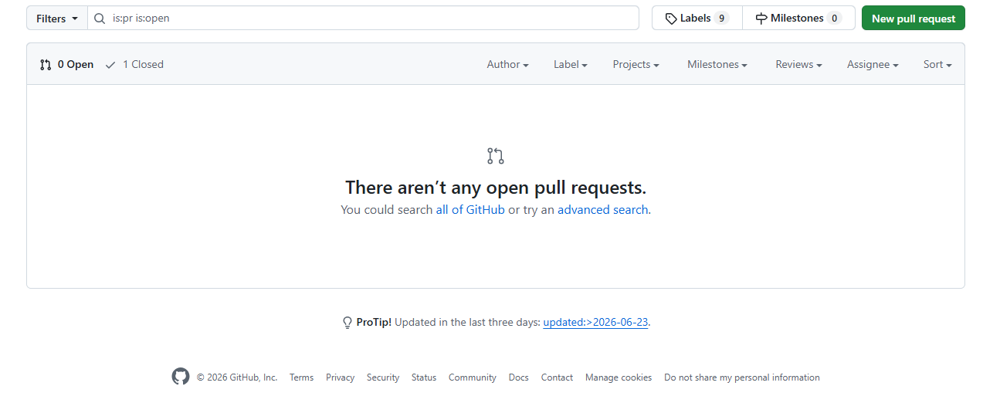
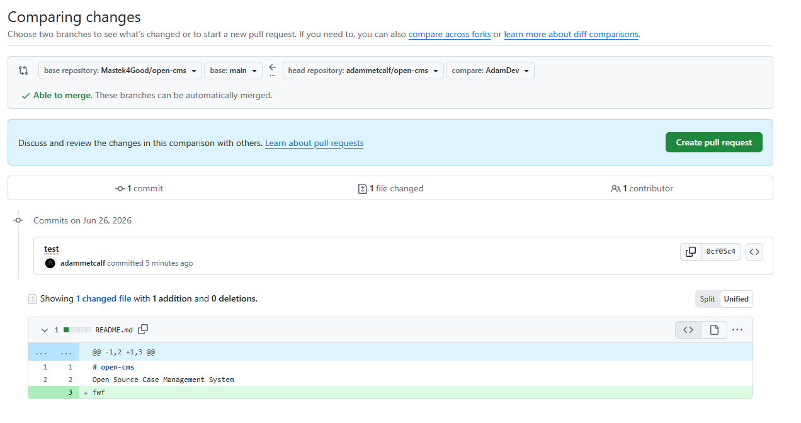

# open-cms
Open Source Case Management System


## How to Contribute
### Fork the repo
Navigate to the Mastek4Good repo and select `Fork`:



This provides a copy of the repo in your github account:


### Clone the Repo

You need access to the repo on your local dev machine to make changes. Hit the `Clone` button and hit the `copy the url to clipboard` button.

**Note:** Setting up your credentials is beyond the scope of this document.
**Note:** Some people prefer a UI and software to manage their git commands (examples include Github Desktop, GitKraken, TortoiseGit). This guide will be using the terminal.

Open a terminal scoped to where you want to work locally on your Dev machine, and use the clone command with the url:
```
git clone git@github.com:adammetcalf/open-cms.git
```

You must rescope your terminal into the directory that has just been cloned:
```
cd open-cms
```
### Doing some work

This is not intended as a comprehensive guide on using git, but these are the minimally viable set of commands necessary to contribute. Its recommended to create a new branch for development work. Lots of people have lots of opinions about the best way to manage this (a branch per feature, a branch per issue etc.). You can manage this how you want, and if you are not super experienced yet feel free to experiment to find the way that suite your own workflow. In general, however, it is considered bad practice to push directly to the main branch.  I will be making and using the branch AdamDev for this.

As an example:
```
git branch AdamDev
git switch AdamDev
```

Alternatively, these can be combined:
```
git switch -c AdamDev
```

Alternatively, some people prefer to use `git checkout -b AdamDev`. There are a few ways of accomplishing this.

To check which branch I am currently working in use the command `git branch`:
```
git branch

* AdamDev
  main
```


### Push and Commit

You have done some work that you would like to contribute. This work is currently on your local dev machine. You must add this, commit with a useful comment, and push this to the remote. On github, you will not that this creates another branch named after your local branch. Add the necessary files to the staging area using `git add`, note that you can add all changed files using `git add .` or you can named specific files.

Commit the staging area with a useful comment using `git commit -m "Add a useful message"`

```
git add .
git commit -m "Updated the ReadMe file"
git push origin AdamDev
```

Note: There are ways to reduce the number of commands required (for example by configuring an _upstream_ branch), but for a beginner it is often better to be explicit. The above commands pushed the changes to a branch named AdamDev in my fork (and created this branch to do so, if necessary). It is recommended not to merge this to the main branch in your own fork, but instead navigate on github to the Mastek4Good/Open-cms repo to create you pull request. This maintains a cleaner git history.

### Pull Request

If you are quick, you will see a nice banner that directly leads to a pull request creation:


Otherwise, you can simply create your own in the `Pull requests` tab:


Ensure that you select the appropriate merge:


Note that I am creating a pull request from the AdamDev branch of my fork into the main branch of the Mastek4Good repo. In the future, it may be the case that there will be a specific branch that you should select as the target. Ensure that you have written a useful message into the pull request.
After someone has checked the pull request it may be merged by an admin, or changes will be requested after review.
